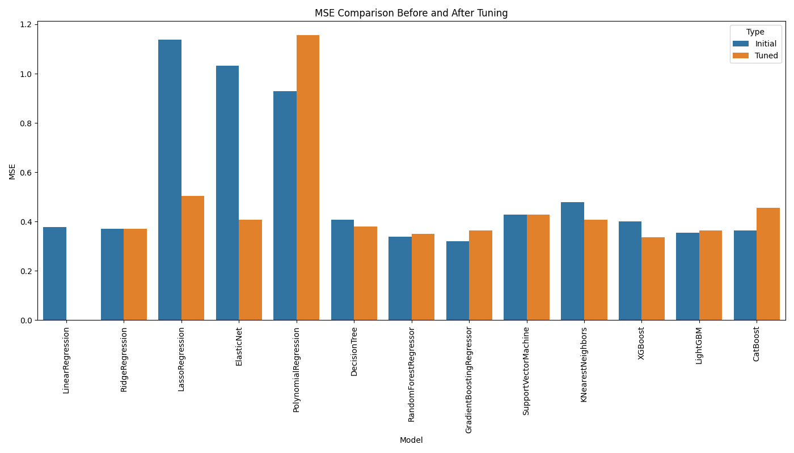

# Hitters Salary Prediction

Bu proje, çalışanların çeşitli özelliklerine (deneyim, eğitim seviyesi, lokasyon vb.) göre maaşlarını tahmin etmeyi amaçlayan bir makine öğrenimi uygulamasıdır. Farklı model ve tekniklerin kullanıldığı bu proje, maaş tahminleri için optimize edilmiş bir model sunmayı hedeflemektedir.

## İçindekiler

- [Proje Yapısı](#proje-yapısı)
- [Özellikler](#özellikler)
- [Kurulum](#kurulum)
- [Kullanım](#kullanım)
- [Sonuçlar](#sonuçlar)
- [Katkıda Bulunma](#katkıda-bulunma)
- [Lisans](#lisans)
- [İletişim](#iletişim)

## Proje Yapısı

- `catboost_info/`: CatBoost modeline ait bilgi ve log dosyaları.
- `data/`: Veri setlerinin bulunduğu klasör.
- `output/`: Proje çıktıları, sonuç dosyaları ve grafikler.
  - `mse_comparison_plot.png`: Farklı modellerin karşılaştırma grafiği.
  - `result.csv`: Tahmin sonuçlarının saklandığı dosya.
- `.gitignore`: Git için gereksiz dosyaların dahil edilmemesi amacıyla kullanılan dosya.
- `config.py`: Proje genelinde kullanılan konfigürasyon dosyası.
- `data_loader.py`: Verilerin yüklenmesi ve işlenmesi için kullanılan yardımcı sınıflar.
- `data_preprocessor.py`: Veri ön işleme fonksiyonları ve sınıfları.
- `feature_selector.py`: Özellik seçimi için kullanılan kodlar.
- `hyperparameter_tuner.py`: Hiperparametre optimizasyonu için kullanılan fonksiyonlar.
- `main.py`: Projenin ana çalıştırma dosyası.
- `model_trainer.py`: Model eğitimi ve değerlendirmesi için kullanılan kodlar.
- `research.py`: Araştırma ve model denemeleri için kullanılan kodlar.
- `visualization.py`: Verilerin ve sonuçların görselleştirilmesi için kullanılan kodlar.

## Özellikler

- **Veri Yükleme ve İşleme:** Verilerin yüklenmesi, ön işlenmesi ve analiz edilmesi.
- **Özellik Seçimi:** Model için en iyi özelliklerin seçilmesi.
- **Model Eğitimi:** CatBoost gibi çeşitli algoritmalarla model eğitimi.
- **Hiperparametre Optimizasyonu:** Modellerin en iyi performansı göstermesi için hiperparametrelerin ayarlanması.
- **Görselleştirme:** Model sonuçlarının grafiksel olarak sunulması.

## Kurulum

Projeyi çalıştırmak için aşağıdaki adımları izleyin:

### Gereksinimler

- Python 3.x
- Gerekli Python paketlerini yüklemek için `requirements.txt` dosyasını kullanabilirsiniz (varsa):

```bash
pip install -r requirements.txt
```

### Çalıştırma

1. Projeyi klonlayın:

   ```bash
   git clone https://github.com/Furk4nBulut/Salary-Prediction.git
   cd Salary-Prediction
   ```

2. Verileri yükleyin ve ön işleme tabi tutun:

   ```bash
   python data_preprocessor.py
   ```

3. Modeli eğitin:

   ```bash
   python model_trainer.py
   ```

4. Sonuçları değerlendirin ve görselleştirin:

   ```bash
   python visualization.py
   ```

## Sonuçlar

- **MSE Karşılaştırması:** Farklı modellerin performansı, `output/mse_comparison_plot.png` dosyasında görselleştirilmiştir.
- **Tahmin Sonuçları:** Tahmin edilen maaşlar `output/result.csv` dosyasında saklanmıştır.


## Katkıda Bulunma

Bu projeye katkıda bulunmak isterseniz, lütfen önce bir `issue` açın. Her türlü katkı ve öneri memnuniyetle karşılanır.

## Lisans

Bu proje MIT Lisansı ile lisanslanmıştır. Detaylar için `LICENSE` dosyasına bakabilirsiniz.

## İletişim

Bu proje hakkında sorularınız varsa benimle iletişime geçebilirsiniz:

- **Email:** [furkanbtng@gmail.com](mailto:furkanbng@gmail.com)
- **GitHub:** [Furk4nBulut](https://github.com/Furk4nBulut)